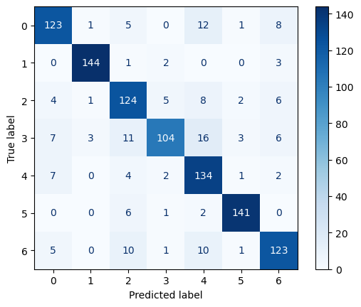
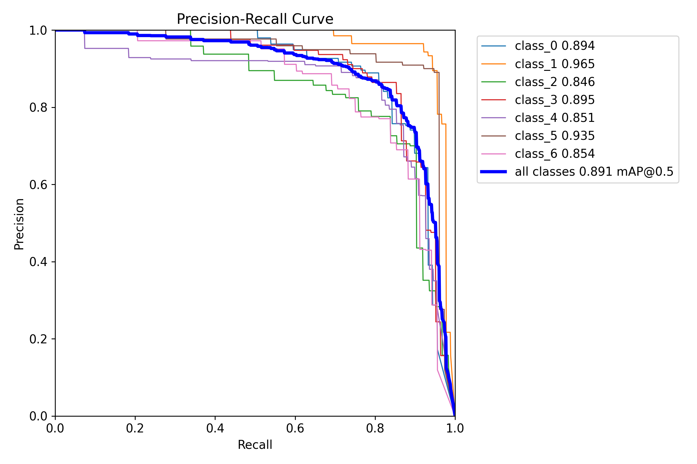

---
# 🌐 AquaSense AI

Welcome to the Team Pharos GitHub repository for the 2025 AI Club Case-a-Thon.

AquaSense leverages deep learning to automate the identification and detection of benthic marine species from underwater imagery, transforming hours of manual analysis into seconds of automated processing.

For more information about our project, methods, and team members, please refer to the information below.

---

## 📖 Table of Contents 

- [About](#-about)
- [Methods](#-methods)
- [Application Demo](#-application-demo)
- [Meet the Team](#-meet-the-team)
---
## 🔬 About

### The Challenge

Marine biologists and environmental researchers spend countless hours manually analyzing underwater imagery to identify and catalog benthic species, the organisms living on or near the ocean floor. Our full-stack application reduces bottlenecks and increases marine research efficiency. 

### Our Solution

**AquaSense AI** is a comprehensive web application that harnesses the power of artificial intelligence and a comprehensive machine learning pipeline to revolutionize benthic species analysis. Built for researchers, marine biologists, environmental organizations, and students, AquaSense automates what once took hours into a process that takes mere seconds.

### Key Features

**Dual-Mode Analysis**
- **Single Species Classification**: Upload an image and instantly identify one of 7 benthic species with over 86% accuracy
- **Multi-Species Detection**: Detect and localize multiple organisms in a single image with 89.1% mAP, complete with bounding boxes and confidence scores

**Project Management Dashboard**
- Organize your marine surveys into collaborative projects
- Track analysis history and metrics over time
- Share findings with team members in real-time

**Advanced Analytics**
- View comprehensive statistics on species distribution
- Export data for further research and reporting
- Visualize trends across multiple surveys

**Secure & Collaborative**
- Firebase authentication with email verification
- Role-based access control for team collaboration
- Cloud storage for seamless data persistence

### Technology Stack

**Frontend**: React + TypeScript + Material-UI + Vite  
**Backend**: FastAPI (Python 3.13) deployed on Render  
**ML Models**: PyTorch (ResNet50) + Ultralytics YOLOv8  
**Database**: Firebase Firestore  
**Authentication**: Firebase Auth  
**Hosting**: Vercel (frontend) + Render (API)

### Real-World Impact

AquaSense accelerates marine research by:
- Reducing analysis time from hours to seconds
- Enabling larger-scale ecological surveys
- Standardizing species identification across research teams
- Making advanced AI tools accessible to researchers worldwide

Whether you're conducting benthic surveys, monitoring ecosystem health, or studying marine biodiversity, AquaSense provides the tools you need to analyze underwater imagery with unprecedented speed and accuracy.

---

## 🚀 Methods
### Machine Learning & Model Development
## Task 1: Species Classification

For the **species classification** task, several model architectures and training strategies were explored.

- Initially, a **custom CNN**(found in archive) was implemented and trained from scratch. However, the model converged very slowly, and each epoch required significant computation time.  
- Next, a **Vision Transformer (ViT)**(found in archive) was developed and trained manually. Although the ViT showed promising early results, it began to overfit after multiple epochs, suggesting it was memorizing the training data.  
- To address these issues, a **transfer learning** approach was adopted using a **pretrained ResNet-50** model as the backbone. A dense linear layer was appended to produce the desired output dimension.  

Training Strategy:
- The pretrained layers were **frozen for the first 5 epochs**, allowing the classifier head to stabilize.  
- The **entire model** was then fine-tuned for several additional epochs.  

**Result:**

  

Final accuracy: **86.9%**  
This approach significantly improved convergence speed and overall classification performance.

---

## Task 2: Object Detection

For the **object detection** task, the **YOLOv8n** model from the Ultralytics YOLOv8 framework was used to detect and localize benthic organisms in underwater imagery.

- The model performed well during initial training.  
- To further enhance detection accuracy, **data augmentation** techniques were introduced and the **input image size** was increased to improve feature resolution.  

**Result:**  

  

- **Precision:** 83.8%  
- **Recall:** 84.9%  
- **mAP@0.50:** 89.1%  
- **mAP@[0.50:0.95]:** 61.9%

These results demonstrate that the model effectively identifies and localizes multiple benthic organism classes with strong detection reliability and spatial accuracy.

---

### Notes
- Task 1 used **PyTorch** for model training and fine-tuning.  
- Task 2 was implemented using **Ultralytics YOLOv8**.  
- Both tasks were trained on local hardware.

---

### Frontend Interface & Backend Infrastructure
[The API methods text I provided]
[UI design, integration, user experience]

---

### API Development

The AquaSense API was built using **FastAPI** (Python 3.13), a modern web framework chosen for its performance and automatic documentation generation. The API is deployed on Render.com with CORS enabled for cross-origin access.

#### Architecture

**Single Species Classification (`/predict`)**
- ResNet50 CNN (46MB) trained on 10,500+ labeled images
- Preprocessing pipeline: resize (256px) → center crop (224px) → normalization
- Returns species name with <3 second inference time

**Multi-Species Detection (`/detect`)**
- YOLOv8 object detection model (17MB) via Ultralytics
- Real-time detection with bounding box localization
- Returns annotated images with boxes, labels, and confidence scores
- Custom mapping layer translates model outputs to 7 species classes

#### Implementation Details

**Request Handling:**
- Images uploaded via multipart/form-data
- Validation: file type (JPEG/PNG), size (<10MB), integrity checks
- Error handling with descriptive HTTP status codes

**Response Processing:**
- PyTorch model inference with CPU optimization
- Base64 encoding for annotated detection images
- JSON responses with species names, confidence scores, and bounding boxes

**Monitoring & Documentation:**
- Comprehensive logging for debugging and performance tracking
- Interactive Swagger UI at `/docs` endpoint
- Health check endpoint for deployment verification

The API enables rapid analysis of benthic survey imagery, processing individual requests in under 3 seconds and supporting real-world marine research workflows.

---

## 💻 Application Demo

  
This is the application demo section

---

## 🙋 Meet the Team

<table>
  <tr>
    <td align="center">
       
      <b>George Beck</b> 
      Finance, William & Mary
    </td>
    <td align="center">
       
      <b>Ricky Speidell</b> 
      Physics, William & Mary
    </td>
    <td align="center">
       
      <b>Jack Zamary</b> 
      Data Science, William & Mary
    </td>
  </tr>
</table>

  
  
  

---

## 🛠️ Built With

### Languages & Frameworks

### Backend & API

### Frontend Tools

### Cloud & Database

### Development Tools

